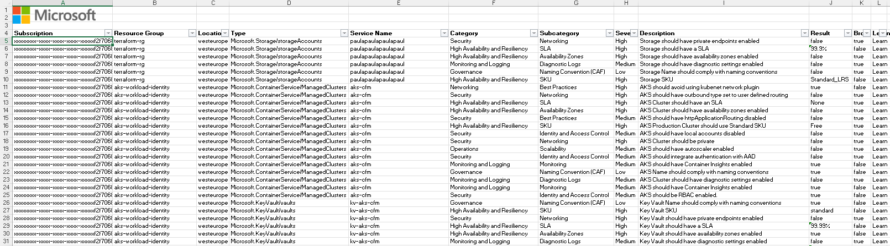

# Azure Quick Review Scan Results

Azure Quick Review (azqr) creates an excel spreadsheet with the following sections:

* [Overview](#overview)
* [Recommendations](#recommendations)
* [Defender](#defender)
* [Services](#services)

## Overview

The overview section contains the following information:

* Subscription Id
* Resoource Group name
* Location
* Resource Type
* Resource Name
* SKU
* SLA: SLA for the instance given the current configuration.
* AZ: True if the instance is Availability Zone aware.
* PVT: True if the instance has a private IP address. 
* DS: True if the instance has diagnotic settings enabled.
* CAF: True if the instance is compliant with the [Cloud Adoption Framework](https://docs.microsoft.com/en-us/azure/cloud-adoption-framework/) naming covention.

## Recommendations

The recommendations section contains a summary of the recommendations for the scanned services:

* Rule Id
* Category: Rule category 
* Subcategory: Rule subcategory
* Description: Rule description
* Severity: Rule severity
* Learn: Link to relevant documentation

## Defender

The defender section contains the following information:

* Name: Microsoft Defender for Cloud plan name.
* Tier
* Deprecated: True if the plan is deprecated.

## Services

The services section contains the following information:

* Subscription: Subscription Id
* Resource Group: Resource Group name
* Location
* Type: Resource type
* Service Name 
* Category: Rule category 
* Subcategory: Rule subcategory
* Severity: Rule severity
* Description: Rule description
* Result: Rule result
* Broken: True if the rule is broken 
* Learn: Link to relevant documentation

